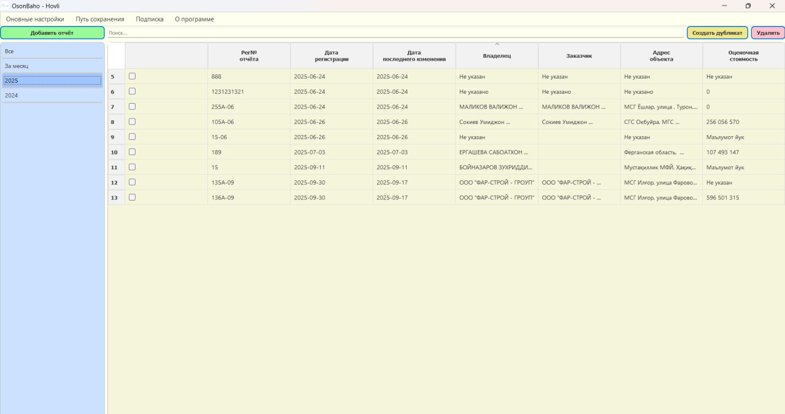
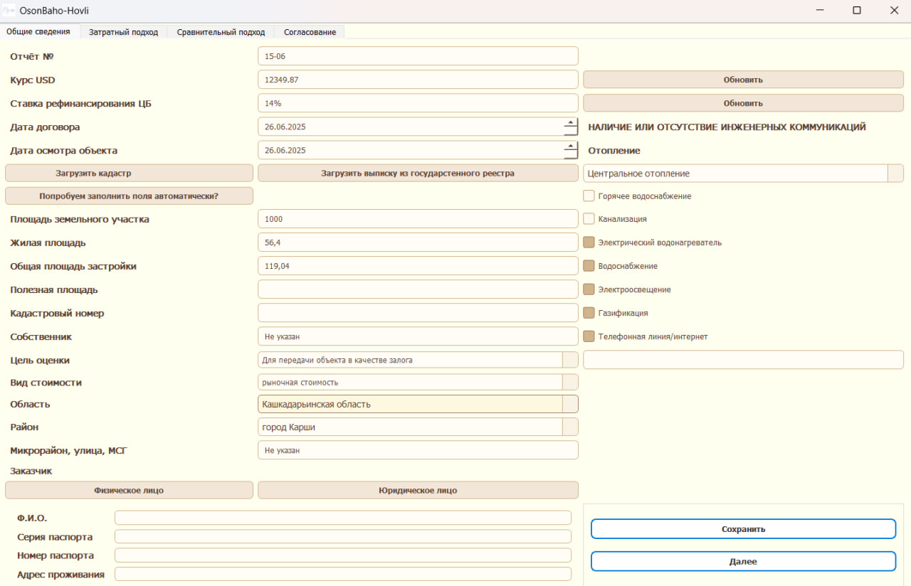
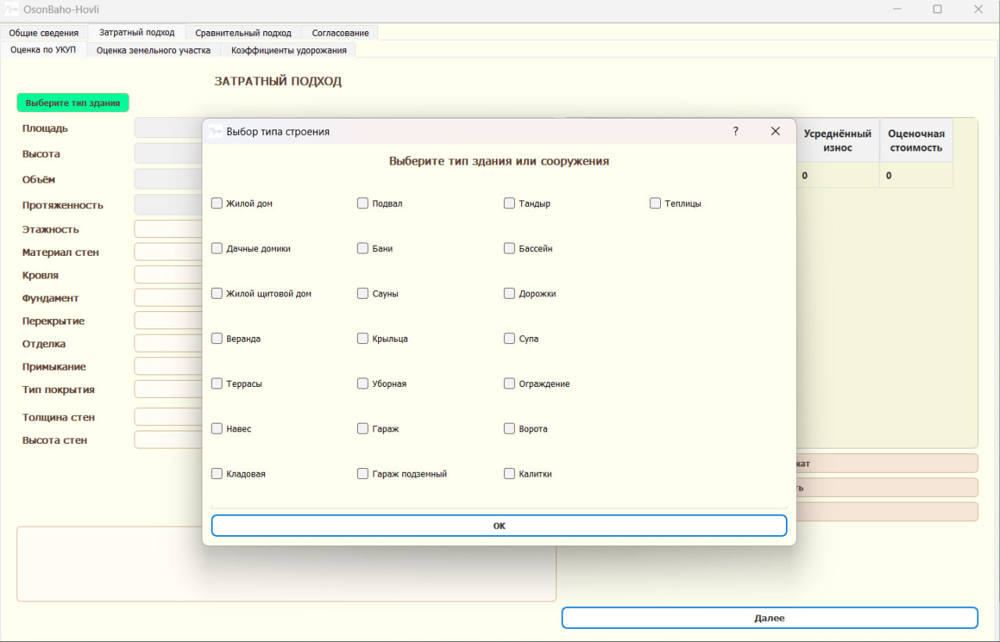

# OsonBaho — Hovli (Единичная оценка домов)

[](#)
[](#)
[](#)
[](#)
[](LICENSE)

**OsonBaho — Hovli** — настольное приложение оценщика для **единичной оценки частных домов** (Hovli) с использованием трёх подходов:
- Сравнительный  
- Затратный  
- Доходный

> ℹ️ Этот репозиторий — **демонстрационный**. Часть кода и данные скрыты по причинам безопасности и защиты ИС. Инструкции по запуску намеренно **не публикуются**.

---

## ✨ Основные возможности
- Ввод ключевых характеристик объекта (площадь, участок, этажность, комнаты и др.)
- Корректировки по сопоставимым объектам
- Расчёт по трём подходам и согласование итоговой стоимости
- Экспорт отчётных форм (черновики, шаблоны)*
- Локализация: ru / uz*

\* функции могут быть в процессе; см. Roadmap.

---

## 📸 Скриншоты
| Главный экран | Корректировки | Отчёт |
|---|---|---|
|  |  |  |

> Скриншоты добавлены для демонстрации интерфейса. Данные — synthetic/mock.

---

## 🧱 Архитектура (высокоуровнево)
osonbaho01/
├─ ui/ # *.ui (Qt Designer) и ресурсы
├─ core/ # доменная логика: правила и расчёты (частично приватно)
├─ data/ # справочники/шаблоны (без приватных датасетов)
├─ docs/
│ ├─ schemas/ # публичные схемы входных/выходных данных (JSON)
│ └─ examples/ # примеры (обезличенные/синтетические)
├─ assets/
│ └─ # скриншоты для README
├─ README.md
└─ LICENSE

---

## 🗂 Форматы данных (публичные схемы)

**Пример схемы входных данных (`docs/schemas/input_house.json`)**:
```json
{
  "$schema": "https://json-schema.org/draft/2020-12/schema",
  "title": "OsonBahoSingleValuationInput",
  "type": "object",
  "properties": {
    "id_district": { "type": "integer" },
    "total_area_m2": { "type": "number", "minimum": 1 },
    "lot_area_sotka": { "type": "number", "minimum": 0 },
    "floors": { "type": "integer", "minimum": 1 },
    "rooms": { "type": "integer", "minimum": 1 },
    "year_built": { "type": "integer", "minimum": 1900, "maximum": 2100 },
    "condition": { "type": "string", "enum": ["poor","fair","good","excellent"] }
  },
  "required": ["id_district","total_area_m2","floors","rooms"]
}

Пример схемы результата (docs/schemas/output_valuation.json):
{
  "$schema": "https://json-schema.org/draft/2020-12/schema",
  "title": "OsonBahoSingleValuationOutput",
  "type": "object",
  "properties": {
    "approach_comparative": { "type": "number" },
    "approach_cost":        { "type": "number" },
    "approach_income":      { "type": "number" },
    "final_value":          { "type": "number" },
    "notes":                { "type": "string" }
  },
  "required": ["final_value"]
}
Автор: Абдусаматов Алиёр Азизович (Фергана, Узбекистан)
Email: aliyor.0276@gmail.com


MIT License

Copyright (c) 2025 Aliyor Azizovich

Permission is hereby granted, free of charge, to any person obtaining a copy
of this software and associated documentation files (the "Software"), to deal
in the Software without restriction, including without limitation the rights
to use, copy, modify, merge, publish, distribute, sublicense, and/or sell
copies of the Software, and to permit persons to whom the Software is
furnished to do so, subject to the following conditions:

The above copyright notice and this permission notice shall be included in all
copies or substantial portions of the Software.

THE SOFTWARE IS PROVIDED "AS IS", WITHOUT WARRANTY OF ANY KIND, EXPRESS OR
IMPLIED, INCLUDING BUT NOT LIMITED TO THE WARRANTIES OF MERCHANTABILITY,
FITNESS FOR A PARTICULAR PURPOSE AND NONINFRINGEMENT. IN NO EVENT SHALL THE
AUTHORS OR COPYRIGHT HOLDERS BE LIABLE FOR ANY CLAIM, DAMAGES OR OTHER
LIABILITY, WHETHER IN AN ACTION OF CONTRACT, TORT OR OTHERWISE, ARISING FROM,
OUT OF OR IN CONNECTION WITH THE SOFTWARE OR THE USE OR OTHER DEALINGS IN THE
SOFTWARE.
